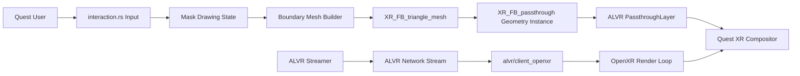

# ALVR Quest Passthrough Mask Prototype

## Scope

Start from [alvr-org/ALVR](https://github.com/alvr-org/ALVR), an MIT-licensed Rust/OpenXR project that already streams PC VR content to Quest and other standalone headsets. The working project lives at `/Users/philip/Repos/sim-addict` as a fork/clone, with `origin` pointing to `phclark/ALVR` and `upstream` pointing to `alvr-org/ALVR`.

First version scope:

- Reuse ALVR's existing Quest/OpenXR client, streaming, decoding, interaction, and lobby infrastructure.
- Add a mask drawing mode for Quest controllers or hands, initially local to the headset client.
- Convert the drawn planar boundary into triangle mesh data and register it with native OpenXR passthrough geometry.
- Use `XR_FB_passthrough` plus `XR_FB_triangle_mesh` / geometry instances so passthrough appears only inside the drawn shape.
- Keep the feature Quest-gated and graceful on runtimes that do not expose the required Meta extensions.
- Avoid cloning Virtual Desktop branding or proprietary UX; the product base is ALVR plus our passthrough-mask feature.

## Architecture

## Implementation Plan

- Keep changes concentrated in ALVR's native Quest client:
  - `alvr/client_openxr/src/passthrough.rs` already wraps passthrough composition layers.
  - `alvr/client_openxr/src/extra_extensions/passthrough_fb.rs` already creates Meta passthrough objects.
  - `alvr/client_openxr/src/interaction.rs` is the likely input hook for controller/hand-driven point placement.
  - `alvr/client_openxr/src/lib.rs` owns session startup, render-loop layer submission, and `PassthroughLayer` lifetime.
- Add a small mask module, likely `alvr/client_openxr/src/passthrough_mask.rs`, containing:
  - `MaskDrawingState`: disabled, drawing, preview, committed, and cleared states.
  - `BoundaryPoint`: pose/space-aware points captured from the controller ray or hand cursor.
  - `BoundaryMesh`: validated vertices/indices for a planar polygon.
  - `triangulate_boundary`: deterministic triangulation for simple polygons, with clear rejection of self-intersections for v1.
- Extend ALVR's Meta passthrough wrapper to support projected geometry:
  - Enable/use `XR_FB_triangle_mesh` when available.
  - Create/destroy `XrTriangleMeshFB` from the committed boundary mesh.
  - Create/destroy `XrGeometryInstanceFB` attached to the existing `XrPassthroughLayerFB`.
  - Keep the existing full-scene passthrough behavior intact for ALVR settings that already use passthrough.
- Add a minimal UX path:
  - A temporary controller binding or debug gesture toggles mask drawing.
  - Trigger adds points, a commit action closes the polygon, and a clear action removes geometry.
  - Render a simple virtual preview line/outline before commit so users can see the boundary they are drawing.
- Add session/settings plumbing only as needed for the prototype. Prefer a local client-side debug toggle first; promote it to ALVR dashboard/session settings after the core passthrough geometry works.
- Document constraints where they affect implementation: Quest apps do not receive raw camera frames; this feature uses compositor-managed passthrough layers. Surface-projected passthrough has limited depth behavior, so the first version should choose predictable overlay/underlay semantics and avoid presenting it as real occlusion.

## Build And Install Loop

- Windows development machine:
  - Clone this fork branch with submodules: `git clone --recurse-submodules --branch feature/passthrough-mask https://github.com/phclark/ALVR.git`.
  - Build the Windows streamer/launcher from that checkout, or download the GitHub Actions artifacts once the dev-artifacts workflow has run.
- Quest headset:
  - Use the generated `alvr_client_android.apk` from the dev-artifacts workflow or an Android local build.
  - Install via `adb install` or SideQuest while the Quest is plugged into the Windows development machine.

## Verification

After implementation, run available project checks before calling the feature complete:

- `cargo xtask check-format`
- `cargo test -p alvr_session`
- `cargo test -p alvr_client_openxr` or the closest package-level test target supported by ALVR.
- `cargo xtask prepare-deps --platform android` if dependencies are not already prepared.
- `cargo xtask build-client --release` when Android SDK/NDK and Quest build prerequisites are installed.
- `cargo xtask build-streamer --platform windows --ci` and `cargo xtask build-launcher --platform windows --ci` on Windows or through GitHub Actions.
